# Pulse

A multi-tenant, real-time analytics dashboard. Several organizations share one app with strict data
isolation and role-based access; live events stream over WebSockets into KPIs, charts, a feed and
threshold alerts, with no page refreshes.

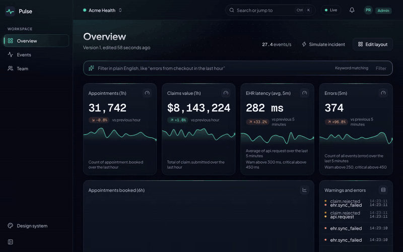

| | |
| --- | --- |
| 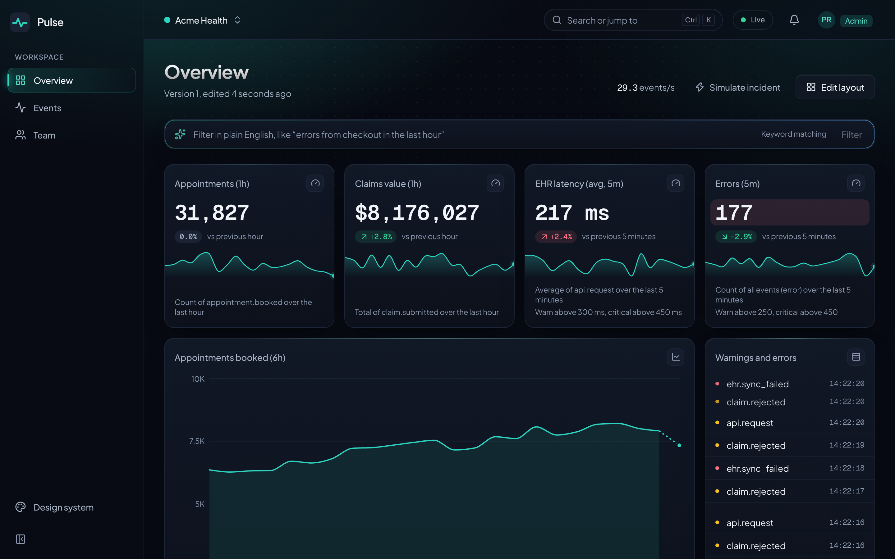 | 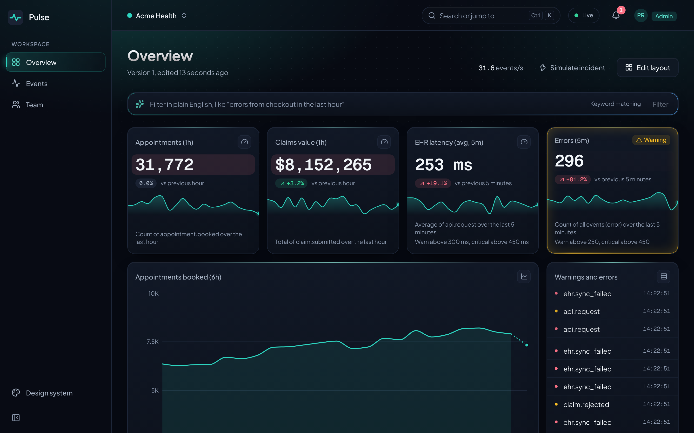 |
| Live dashboard (Acme Health) | Alerts during a simulated incident |
| 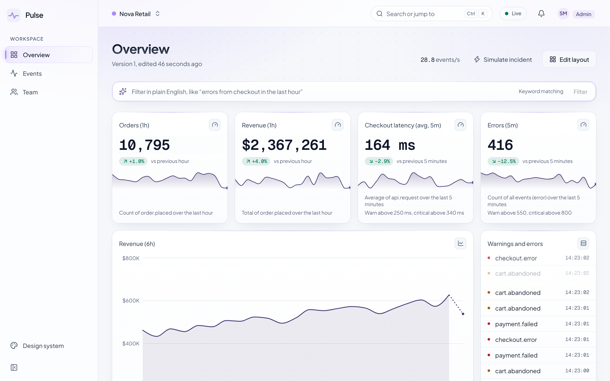 | 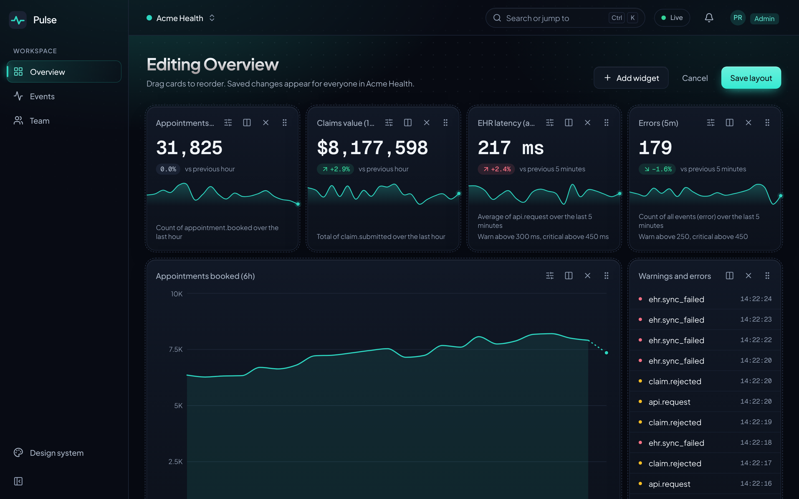 |
| Light theme, another tenant's accent | Edit mode for admins |
| 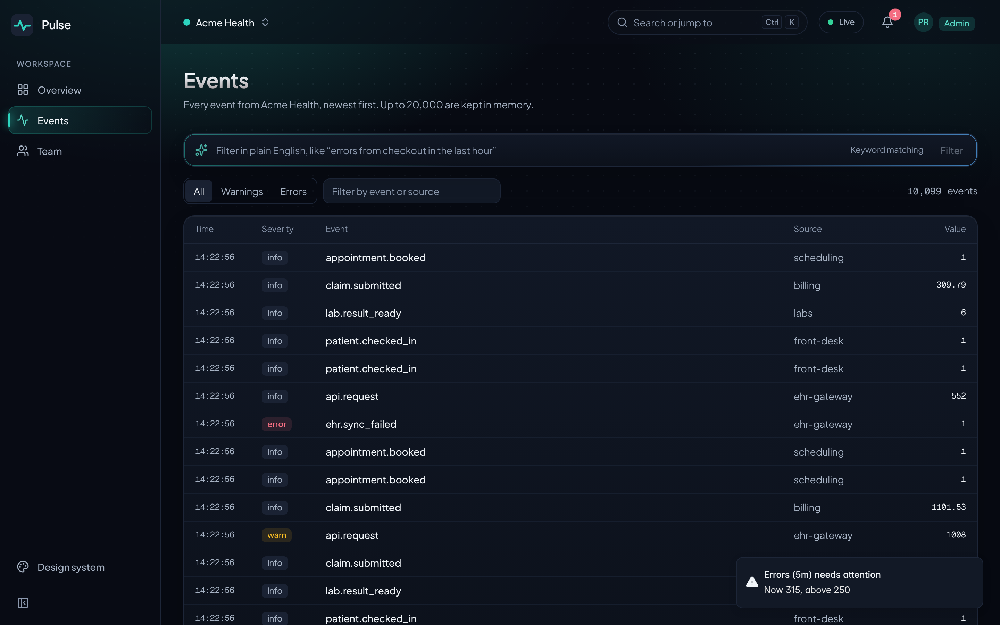 | 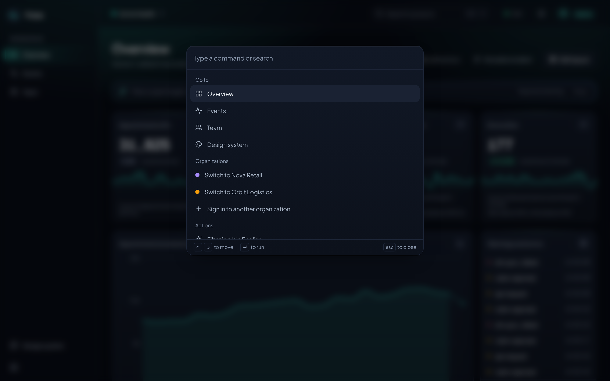 |
| Live Events page, 10,000+ rows | ⌘K command palette |
| 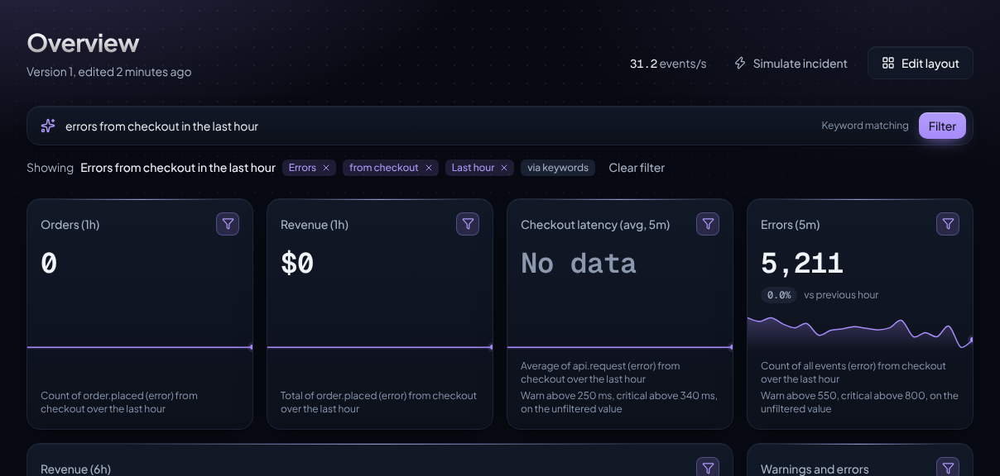 | |
| "errors from checkout in the last hour" | |

## Quick start

Requires Node 22.12+.

```bash
npm install
npm run dev       # API + WebSocket on :4000, web on :5173
```

Open http://localhost:5173 and click **Sign in to all three as admin** to try the tenant switcher, or
pick a single account. Every demo password is `pulse-demo-2026`.

| Tenant          | Admin            | Viewer            |
| --------------- | ---------------- | ----------------- |
| Acme Health     | admin@acme.test  | viewer@acme.test  |
| Nova Retail     | admin@nova.test  | viewer@nova.test  |
| Orbit Logistics | admin@orbit.test | viewer@orbit.test |

Things to try: switch tenant (top left), press ⌘K, **Simulate incident** to watch alerts fire, **Edit
layout** as an admin while a viewer of the same tenant watches in another window, the Events page, and
typing *errors from checkout in the last hour* into the filter bar (as Nova Retail).

Natural-language filters use Claude when `ANTHROPIC_API_KEY` is set in `apps/server/.env` (see
`.env.example`); without a key they use keyword matching, so everything works offline.

## Tech stack

TypeScript (strict, no `any`) everywhere, in an npm-workspaces monorepo:

```
apps/web         Vite, React 19, Tailwind v4, shadcn-style components (Radix), Motion, TanStack Query,
                 Zustand, Recharts, react-window, cmdk, dnd-kit
apps/server      Node, Express 5, ws, jose (JWT), Zod, Anthropic SDK
packages/shared  Zod schemas + types, the role/permission table, and the rollup maths, used by BOTH sides
```

## Architecture

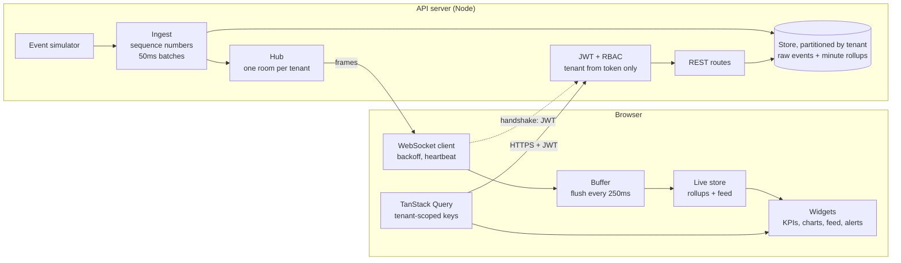

Both sides import `@pulse/shared`: the Zod schemas that validate every request, response and WebSocket
frame, the role-to-permission table, and the rollup maths, so server and client can't drift apart.

How a client goes live without missing or double-counting an event:

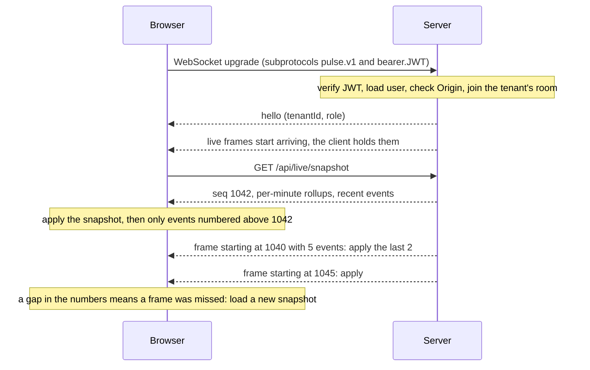

```
apps/server/src
  auth/          JWT signing and verification; resolveAuth() loads the user and role per request
  middleware/    authenticate (one line protects every /api route), requirePermission
  routes/        auth, events, dashboards, users, live (snapshot + simulate incident), ai (filters)
  ai/            prompt builder, Claude interpreter (streaming), the tenant's filter vocabulary
  realtime/      ws-server (handshake auth, heartbeat, expiry), hub (tenant rooms), ingest
  sim/           event generator with daily traffic curve and incidents
  store/         Store interface + in-memory implementation, partitioned by tenant
apps/web/src
  components/    ui primitives, app shell (sidebar, top bar, tenant switcher, ⌘K, live indicator)
  features/      dashboard (registry, widgets, charts, edit mode), alerts (engine + store),
                 ai-filter (filter bar, SSE reader, partial-JSON preview, per-tenant filter store)
  realtime/      socket, buffer, sequence checks, backoff, use-realtime
  stores/        sessions (one token per tenant), live data, UI preferences, connection status
  routes/        lazy-loaded pages
  perf/          ?perf= switches and the in-app performance monitor
```

## Multi-tenancy and security

- **The tenant comes only from the JWT.** Request schemas are `.strict()`, so a `tenantId` in a body or query string is rejected with 400 rather than ignored.
- **The role is reloaded on every request**, so demoting or deleting a user takes effect on their next request, not when their token expires.
- **Other tenants' resources return 404, not 403**, so callers can't confirm that an id exists. Inviting someone who belongs to another tenant succeeds instead of revealing it.
- **Isolation by construction:** the store keeps one partition per tenant, and the WebSocket hub has one room per tenant with no "broadcast to all".
- **WebSocket auth happens during the HTTP upgrade**, with the token in `Sec-WebSocket-Protocol` so it never appears in a URL or access log. The server also checks the Origin, closes the socket with code 4001 when the token expires, sends heartbeats, and drops clients that fall too far behind.
- **One role-to-permission table** (`packages/shared/src/permissions.ts`) drives both the server checks and what the UI shows.
- **Several organizations at once** in the browser, like Slack workspaces: each has its own tenant-scoped token, and switching changes which token is active.

| Method | Path | Permission | Admin | Viewer |
| --- | --- | --- | :---: | :---: |
| POST | `/api/auth/login` | none (rate limited) | ✓ | ✓ |
| GET | `/api/auth/me` | signed in | ✓ | ✓ |
| GET | `/api/events` | `events:read` | ✓ | ✓ |
| GET | `/api/live/snapshot` | `events:read` | ✓ | ✓ |
| GET | `/api/dashboards[/:id]` | `dashboard:read` | ✓ | ✓ |
| PUT | `/api/dashboards/:id` | `dashboard:write` | ✓ | 403 |
| GET | `/api/users` | `users:read` | ✓ | ✓ |
| GET, POST | `/api/users/invites` | `users:invite` | ✓ | 403 |
| POST | `/api/live/incident` | `incidents:simulate` | ✓ | 403 |
| GET | `/api/ai/status` | `events:read` | ✓ | ✓ |
| POST | `/api/ai/filter` | `events:read` (20 per minute per user) | ✓ | ✓ |
| WS | `/ws` | signed in | ✓ | ✓ |

## Real-time pipeline

- **Per-minute rollups instead of raw events.** Each minute keeps `{count, sum}` per event type, source and severity. Six hours of data at 60 events/sec is about 1.3 million events but only ~360 rollup records. KPIs and charts use the same `computeMetric` on server and client.
- **Sequence numbers.** Every tenant's events are numbered. The snapshot and each frame say where they start, so the client applies exactly the events it doesn't have yet (see the diagram above).
- **Buffering.** Frames go into a plain array outside React, and one store update every 250ms applies them all. The render rate stays about 4 per second whatever the traffic.
- **Narrow selectors.** Each KPI subscribes to one rounded number, so it re-renders only when the number it shows changes. Number animations write straight to the DOM, costing no React renders.
- **Reconnect.** Exponential backoff with full jitter (0.5s doubling to a 30s cap), an app-level ping that catches silently dead connections, and an immediate retry when the browser comes back online or the tab becomes visible.

## Widgets and alerts

- **Schema-driven widgets.** A dashboard is JSON: widget configs validated by Zod (`kpi`, `line`, `bar`, `feed`, `alertList`; title, metric, thresholds, layout). A typed registry maps each type to its renderer, and the build fails if a type has none. Adding a widget is a config change.
- **Edit mode (admins).** Drag and drop (keyboard accessible), resize, remove, add from templates, edit thresholds. Saves are optimistic with a version check: if another admin saved first you get a "Reload" prompt instead of overwriting their work. Every viewer's grid animates to the new layout live.
- **Alerts with hysteresis.** A level must hold for 3 seconds to fire and 10 seconds to clear, so values hovering at a threshold don't flap. Firing shows a pulsing border, a Warning or Critical badge (always icon plus word), a toast, and a count on the bell.

## Visual design

The design system follows [UI/UX Pro Max](https://uupm.cc)'s recommendation for a real-time SaaS
dashboard (glassmorphism on a dark slate base, bento grid, 4.5:1 text contrast, visible focus, reduced
motion), with signature effects adapted from [21st.dev](https://21st.dev) components (Magic UI, MIT).

- **Type:** Plus Jakarta Sans for the interface, Geist Mono with tabular figures for every number.
- **Backdrop:** aurora glows in the tenant's accent over a dot grid (Magic UI *Dot Pattern*), so the
  whole app takes on the tenant's colour.
- **Cards:** a spotlight that follows the pointer (Magic UI *Magic Card*), a hairline of tenant colour on
  the top edge, icon chips, and KPI sparklines with a change-versus-previous-period pill.
- **Light borders:** a beam around alerting widgets and a shine around the AI filter while it streams
  (*Border Beam*, *Shine Border*); a gradient headline and shiny badge on the sign-in screen.
- **Glass where it's affordable:** blur only on overlays and the top bar once content scrolls under it.

Each effect was rebuilt to stay off the main thread. The originals animate `offset-distance`,
`background-position` or a gradient's position, which repaint every frame; here they are elements moved
with `transform` (a conic gradient rotating behind a ring mask, a glow orb following the pointer).
Every effect was A/B tested with `perf/browser-load.ts` (`PERF_CSS` switches one off). That found the one
real cost: the backdrop painted as the page's own background was re-rasterized under every live number.
On its own fixed layer it's painted once. Measured back to back under the stress load, the redesign is
within ~3% of the previous UI (44.4 vs 45.6 fps; run-to-run noise is about ±2 fps).

## Motion

Built with [Motion](https://motion.dev). One motion system (`apps/web/src/lib/motion.ts`) defines every
spring and easing, written as `visualDuration` + `bounce` ("looks done in 0.22s, barely bounces")
instead of raw stiffness and damping.

| Moment | Animation | Why |
| --- | --- | --- |
| Sign in | The logo flies from the login card into the sidebar (`AnimateView` shared element) | The one moment that connects two screens |
| Changing page | Fade-through: old page out in 100ms, new page in with a 6px rise (`AnimateView`, View Transitions API) | Overview, Events and Team are siblings, so no directional slide; the sidebar stays still |
| Switching tenant | Whole-frame fade-through while the accent colour morphs (typed view transition) | Two tenants' numbers are never on screen together |
| Dashboard load | Cards stagger in 40ms apart, once per visit | Orchestrated once; repeat visits are just the page fade |
| Live data | Numbers and bars spring to new values; feed rows slide in; charts extend | Slow enough to follow (`spring.data`) |
| Layout edits | Cards spring to new positions on every viewer's screen (`layout`) | Shows *what* moved |
| AI filter | Chips appear as the answer streams, then glide into the applied row (`layoutId`) | Makes streaming visible |
| Alerts | Pulsing border, bell bounce (the only spring that overshoots) | Bounce means "look at me" |

Rules: only `transform` and `opacity` animate (compositor-only), chrome stays under ~250ms, and with
*reduce motion* on, transforms stop, view transitions are skipped entirely and only short fades remain.
View transitions also cost nothing in browsers without the API; pages just swap.

## Natural-language filters

Type *errors from checkout in the last hour* and every widget, the live feed and the Events page narrow
to it. The filter assembles itself as chips while the answer streams in; each chip can be removed.

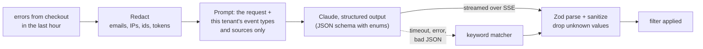

- **The model returns data, never code or queries.** Output is constrained by a JSON schema whose enums are this tenant's own event types and sources, then parsed by the shared Zod schema and sanitized again on the server. The worst a prompt injection can do is produce an odd filter on the user's own dashboard.
- **No raw user data reaches the LLM.** The prompt holds only the typed request (with emails, IPs, long numbers and tokens redacted) and the *names* of this tenant's event types and sources. No events, values, user ids, tenant name or other tenants' vocabulary; a test asserts this on the exact prompt.
- **Always a working fallback.** With no API key, on a timeout (12s), a model error, invalid JSON or the wrong shape, the server uses a rule-based parser and says so in a note. The UI never breaks.
- **Streaming.** Server-sent events over `fetch` (POST, so the token goes in a header; `EventSource` can only GET). A partial-JSON parser drives the live preview, but only the server's validated result is ever applied.
- **Tenant-scoped like everything else.** The vocabulary comes from the caller's tenant (from the JWT), filters are stored per tenant in the browser, and requests are rate limited per user.
- **Honest widgets.** A filtered widget shows a funnel icon and its caption describes what it's counting now. Thresholds and alerts keep using the unfiltered value, because a view filter must never silence an alert. A widget the filter can't apply to says "No events match this filter" instead of showing 0.

## Testing

```bash
npm test                        # 166 unit + integration tests (Vitest)
npx playwright install chromium # once
npm run e2e                     # end-to-end test (Playwright, real server + production build)
npm run test:all                # typecheck + all of the above
```

| Where | What it proves |
| --- | --- |
| `apps/server/test/isolation.rest.test.ts` | An admin of one tenant can't read, write, list or probe another tenant's data via REST |
| `apps/server/test/isolation.ws.test.ts` | 600 interleaved events across 3 tenants: each socket receives only its own tenant's events |
| `apps/server/test/rbac.test.ts` | The permission table, row by row, for every route and role; demoted and deleted users |
| `apps/server/test/live.test.ts` | Snapshot and live frames line up exactly by sequence number |
| `apps/server/test/ai.test.ts` | Filters stream and validate; invented or other tenants' values are dropped; invalid output, errors and timeouts fall back to keywords; the prompt contains no user data; 401, 400 and 429 |
| `packages/shared/test/*` | Schemas, permission table, rollup maths (including the partial-minute weighting) |
| `apps/web/src/**/*.test.ts(x)` | React Testing Library: KPI widget reading the live store, role-based Invite button, login validation, threshold dialog, filter bar streaming a preview then applying the result; plus the buffer, backoff, sequence checks, alert engine, SSE parser (every chunk split) and partial JSON |
| `e2e/multi-tenant-live.spec.ts` | An admin removes a widget; a viewer of the same tenant sees it disappear live and can't edit; a viewer of another tenant sees no change |

## Performance

Measured with `npm run perf:browser` and `npm run perf:ws`. Method and the full tables are in
[PROFILING.md](PROFILING.md) and [`perf/results/`](perf/results). Three tenants open at once, 100 events/sec
per tenant, same production build, only `?perf=` flags changed. Measured on a 2-core Linux container,
so look at the ratios.

| | Naive | Optimized |
| --- | ---: | ---: |
| Dashboard FPS | 7.9 | **56** |
| React render time per second | 516 ms | **27 ms** |
| Widget renders per second | 228 | **29** |
| Main thread blocked per second | 166 ms | **4 ms** |
| Events page (10,000 rows): FPS | 1.4 | **60** |
| Events page: DOM nodes | 82,484 | **293** |
| Server CPU, 300 sockets (1ms vs 50ms batching) | 21% | **8%** |

## Deploy

Two options, both configured in the repo:

- **One Vercel project with services** (`vercel.json`): the Vite app at `/`, and the API container at
  `/api/*` and `/ws` on the same domain. Simplest; the API runs as auto-scaling Vercel Functions, so
  in-memory state is per instance (fine for a demo).
- **Vercel for the web app, Render for the API** (`render.yaml`, `Dockerfile`): one long-running server,
  consistent live data under real traffic.

A GitHub Actions workflow runs the typecheck, tests, build and the end-to-end test on every push.
Step-by-step instructions, environment variables and a smoke-test checklist are in [DEPLOY.md](DEPLOY.md).

## Design decisions and trade-offs

- **In-memory store behind an interface.** Fast to build and demo; data resets on restart. The `Store` interface is the seam for Postgres (with row-level security as a second isolation layer).
- **Single server instance.** Tenant rooms and the login rate limiter live in process memory. Horizontal scaling needs Redis (or Postgres LISTEN/NOTIFY) between instances.
- **Tokens in localStorage.** Simple, and works for the multi-organization switcher. An XSS bug could read them; httpOnly cookies with CSRF protection would be the production choice.
- **Alerts evaluated in the browser.** They fire on any page while the app is open. Server-side evaluation is the next step for email or Slack notifications.
- **50ms server batching.** Adds ~25ms median latency and cuts server CPU by more than half; invisible on a dashboard.
- **AI filters are view-only.** They narrow what you see and never change saved widgets, thresholds or alerts. Saving a filter as a widget would be a natural next step, behind `dashboard:write`.

## Other docs

- [PROFILING.md](PROFILING.md): verifying renders with React DevTools, the `?perf=` switches, running the load tests
- [DEPLOY.md](DEPLOY.md): Render + Vercel step by step
- `/design` in the running app: a live reference of the design tokens and components
